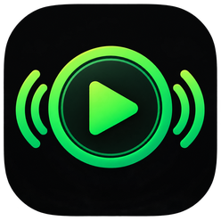

<div align="center">
  

  # Spotify Remote for Amazfit Bip 6

  **Control Spotify from your wrist—with playlists, search, liked songs, artwork, queue access, and phone volume.**

  [](https://docs.zepp.com/)
  [](#compatibility)
  [](package.json)
  [](package.json)
</div>

## Overview

Spotify Remote is a Zepp OS mini app made for the Amazfit Bip 6. It connects to Spotify through the phone-side Zepp service and presents a compact, scrollable interface designed for the watch display.

> This is an independent project and is not affiliated with, sponsored by, or endorsed by Spotify or Amazfit.

## Features

| Area | What you can do |
| --- | --- |
| Now playing | View the current song, artist, progress, and album artwork |
| Playback | Play/pause and move to the previous or next track |
| Album art | Tap the current cover to open it fullscreen |
| Playlists | Browse up to 50 playlists, search locally, and filter by **All**, **Mine**, or **Spotify** |
| Liked Songs | Browse up to 30 saved tracks with lightweight cover previews and start playback |
| Search | Search Spotify by song, artist, or album and play a result |
| Queue | View the current queue, search for tracks, and add tracks or episodes |
| Volume | Open the Bip 6 native Music controller to change the phone's media volume |

## Requirements

- Amazfit Bip 6 with Zepp OS 4.x
- Zepp app running on the paired phone
- Bluetooth connection between the phone and watch
- Internet access on the phone
- Spotify account with access to the required Web API playback features
- Node.js 20 and Zeus CLI for development

An active Spotify playback device is required for playback commands. Start a song on the phone if Spotify reports that no player is available.

## Sign in to Spotify

Authentication uses Spotify OAuth with PKCE. The app never asks for your Spotify password.

1. Install the mini app and open its settings page inside Zepp.
2. Tap **1) Prepare**.
3. Tap **2) Login** and approve the requested Spotify permissions.
4. Return to Zepp and wait for the **Logged in** status.
5. Start Spotify on the phone, then open **Spotify Control** on the watch.

If Spotify reports `insufficient client scope`, open the settings page, tap **Clear login**, and repeat the sign-in flow so the current permissions can be granted.

<details>
  <summary><strong>Using your own Spotify application and callback server</strong></summary>

Create an application in the [Spotify Developer Dashboard](https://developer.spotify.com/dashboard), then enter its Client ID in the Zepp settings page. Add this redirect URI to the Spotify application:

```text
https://YOUR-AUTH-SERVER/api/callback
```

Enter the HTTPS server base URL—not the `/api/callback` path—in **Auth server URL**. The automatic flow expects compatible `/api/callback` and `/api/poll` endpoints. A manual authorization-code fallback is also available from the settings page.
</details>

## Build from source

Install [Node.js 20](https://nodejs.org/) and the Zepp OS command-line tools, then run:

```bash
npm install
npm test
npm run build
```

The installable `.zab` package is written to `dist/`. Install it through the Zepp developer-mode mini-app workflow.

## Project structure

```text
app-side/   Spotify Web API requests and artwork transfer
assets/     Watch icons and interface images
page/       Watch pages and responsive layouts
setting/    Spotify login and configuration page in Zepp
tests/      Regression tests
app.json    Zepp OS manifest
```

## Known limitations

- Spotify does not provide Web API operations for removing or reordering queue items. The app can view the queue and add new items.
- Phone volume is controlled by the watch's native Bluetooth Music controller, not by Spotify's API.
- Artwork is downloaded by the phone-side service and transferred in watch-friendly sizes to reduce memory use.
- The app depends on the phone, Zepp background service, Spotify availability, and the permissions granted to the Spotify application.

## Development notes

- App ID: `26263`
- App version: `1.5.0`
- Design width: `390`
- Target profile: `gt.s`
- Runtime API: Zepp OS `4.0`

If you publish a fork through the Zepp developer console, replace the local app ID with the ID assigned to your application.

---

<div align="center">
  Made for quick music control without taking the phone out of your pocket.
</div>
